# 正则表达式教程

## 介绍

本教程来自`UCB EECS151 ASIC Lab1`推荐阅读的教程：[Learn Regular Expressions with simple, interactive exercises.](https://regexone.com)

## Lesson 1: 简介

正则表达式（Regular expressions）在从代码、日志文件、电子表格甚至文档（ code, log files, spreadsheets, or even documents）等文本中提取信息方面非常有用。虽然形式语言（formal languages）背后有很多理论，但本课程和示例将探索正则表达式的更实际用途，以便可以尽快使用它们。

使用正则表达式时要识别的第一件事是，**一切本质上都是字符（ everything is essentially a character）**，我们正在编写模式来匹配特定的字符序列（sequence of characters，也称为字符串，string）。大多数模式使用普通的`ASCII`，其中包括字母、数字、标点符号（letters, digits, punctuation）和键盘上的其他符号，如%#$@!，但`Unicode字符`也可用于匹配任何类型的国际文本。

请注意以下图片中键入字符时是如何匹配的：


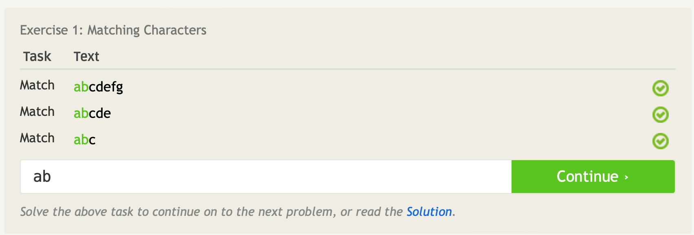

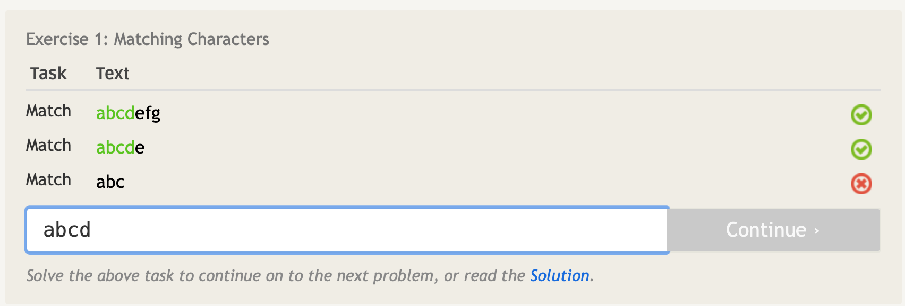

## Lesson 1½: 数字（digits）

字符包括普通字母（normal letters），但也包括数字（digits）。事实上，数字0-9也只是字符，如果您查看`ASCII表`，它们会按一定的顺序列出。

在本课程中，您将了解一些用于正则表达式的**特殊元字符（metacharacters）**，这些元字符可用于匹配特定类型的字符。

字符`\d`可以代替从0到9的任何一个数字。前面的斜杠将其与简单的d字符区分开来，并表示它是一个元字符。

与之对应的，`\D`可以代替非数字的任何一个字符。

注意下图的模式如何匹配字符串中的任何地方，**而不仅仅是从第一个字符开始：**

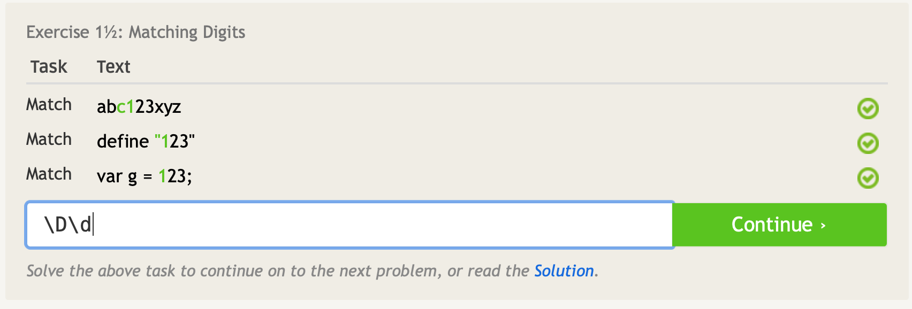

## Lesson 2: 点（`.`dot）

我们经常使用正则表达式匹配不知道确切内容的文本，但它们具有共同的模式或结构（pattern or structure），例如电话号码或邮政编码。

通配符（wildcard）由`.`元字符（metacharacter）表示，可以匹配任何单个字符（字母、数字、空格、所有内容）。

您可能会注意到，这实际上覆盖了句号字符的匹配，因此为了具体匹配句点，您需要使用斜杠（slash）`\.`相应地转义点（escape the dot）。

下图是几个字符不同但长度相同的字符串，要匹配前三个字符串必须转义点元字符以匹配某些行中的点：

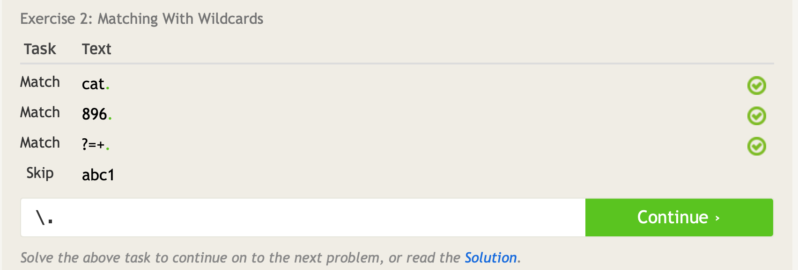

## Lesson 3: 匹配特定字符（Matching specific characters）

有一种方法可以使用正则表达式匹配特定字符，方法是在方括号内定义它们。

例如，`[abc]`将只匹配单个a、b或c字母，而不会匹配其他字母。

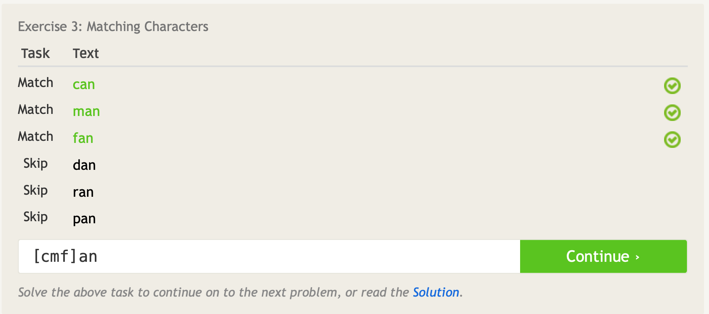

## Lesson 4: 排除特定字符（Excluding specific characters）

使用方括号`[]`和`^`（hat）排除特定字符。

例如，`[^abc]`将匹配除字母a、b或c以外的任何单个字符。

请注意，这种类型的大多数图案也可以用上一课中的技术来书写，可以在编写自己的模式时决定哪一个更容易编写和理解。


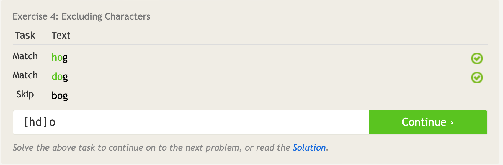

## Lesson 5: 字符范围（Character ranges）

如果我们想匹配一个可以处于顺序范围字符的字符呢？

幸运的是，在使用方括号`[]`表示法时，通过使用破折号`-`来指示字符范围来匹配顺序字符列表中的字符。

例如，`[0-6]`只会匹配从零到六的任何一位数字字符，而不会匹配其他字符。

同样，`[^n-p]`只会匹配除了字母n到p外任何单个字符。

同一组括号中也可以与单个字符一起使用多个字符范围。这方面的一个例子是字母数字`\w`元字符，它等同于字符范围`[A-Za-z0-9_]`，通常用于匹配英语文本中的字符。

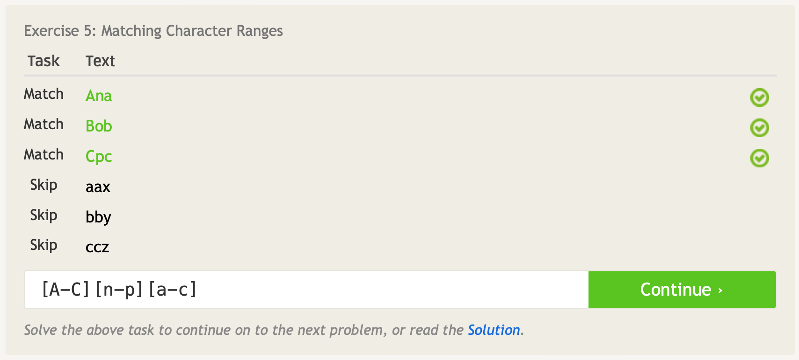

## Lesson 6: 重复匹配（Catching some zzz'）

**注意：并非所有正则表达式实现都支持以下重复语法的某些部分。**

到目前为止，我们已经学会了如何指定我们想要匹配的字符范围，但我们想要匹配的字符的重复次数如何？我们可以做到这一点的一种方法是使用大括号表示法`{}`指定每个字符的重复次数。

例如，`a{3}`将恰好匹配一个字符三次。某些正则表达式引擎甚至允许您为这种重复指定一个范围，例如，`a{1,3}`将匹配字符不超过3次，但不少于1次。

此数量`{n}`可以与任何字符或特殊元字符一起使用，例如`w{3}`（3个w），`[wxy]{5}`（五个字符，每个字符可以是w、x或y）和`.{2,6}`（任2-6个任意字符）。

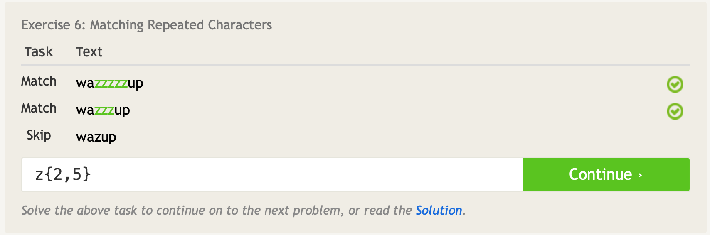

## Lesson 7：匹配任意数量（Mr. Kleene, Mr. Kleene）

正则表达式中一个强大的概念是匹配任意数量的字符的能力。

例如，有两个数字：`$25,000`和`$25`

为了匹配上述数字，我们可以使用`\d*`来匹配任意数量的位数，但更严格的正则表达式是`\d+`，这可以确保输入字符串至少有一位数字。

这些量词可以与任何字符或特殊元字符一起使用，例如`a+`（一个或多个a）、`[abc]+`（任何a、b或c字符的一个或多个）和`.*`（没有字符或者有任意数量的任意字符）。

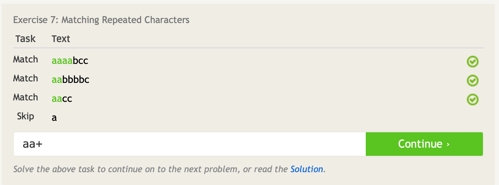

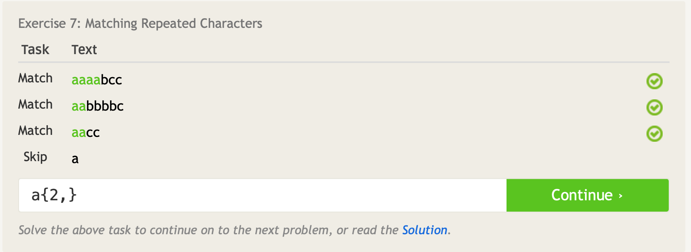

## Lesson 8: 字符可选（Characters optional）

另一个在匹配和提取文本（matching and extracting text）时真正常见的量词（quantifier）是`?`，表示可选性的元字符。

此元字符允许您匹配前一个字符或字符组0个或一个。例如，模式`ab?c`将匹配字符串“`abc`”或“`ac`”，因为`b`被认为是可选的。

与`.`点元字符类似，问号是一个特殊字符，必须使用斜杠`\?`匹配字符串中的普通问号字符。

在下面的字符串中，请注意“文件”一词的复数如何取决于找到的文件数量。尝试编写一个使用可选元字符的模式，仅匹配找到一个或多个文件的行。

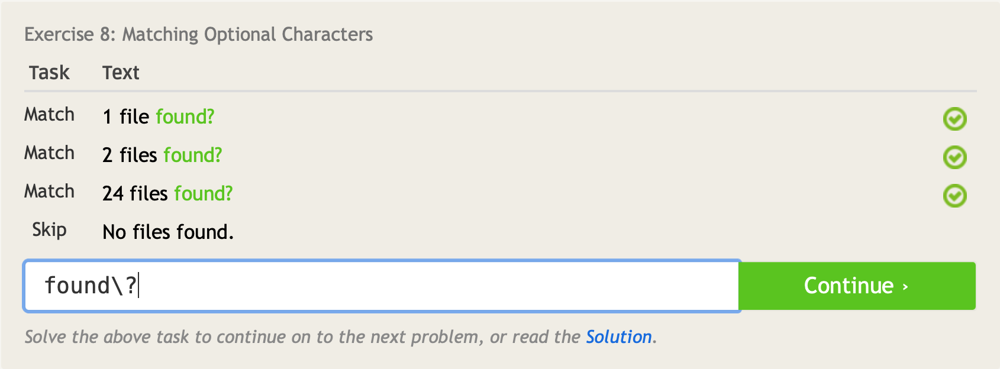

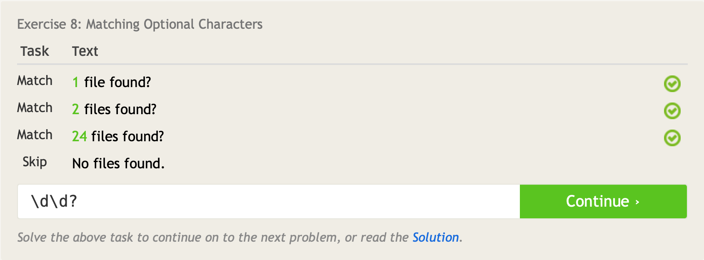

## Lesson 9：所有这些空白（All this whitespace）

在处理现实中的输入，如日志文件（log files）甚至用户输入（user input）时，很难不遇到空白。我们用它来格式化（format）信息片段，使其更容易在视觉上阅读和扫描，单个空格可以将扳手放入最简单的正则表达式中。

您将与正则表达式一起使用的最常见的空白形式是空格（`␣`）、制表符（`\t`）、新行（`\n`）和回车符（`\r`）（在Windows环境中有用），这些特殊字符匹配各自的空格。此外，**空格特殊字符`\s`将匹配上述任何特定空格**，在处理原始输入文本时非常有用。

与之对应，`\S`匹配任何不是空格的字符。

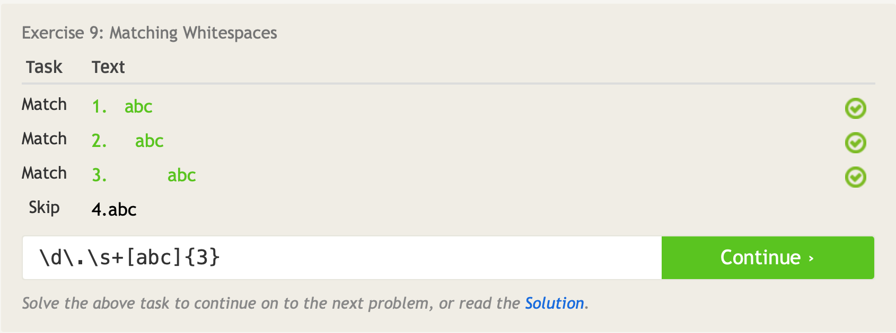

## Lesson 10: 开始和结束（Starting and ending）

使用`^`（hat）和`$`（dollar sign）元字符（metacharacters）定义一个描述行开始和结束的模式。

例如，我们可以使用`^success`仅匹配以“success”开头的行。如果使用`^success$`，将创建一个在开头和结尾完全匹配success的表达式。

请注意，这与一组括号`[^...]`内用于排除字符的帽子不同。

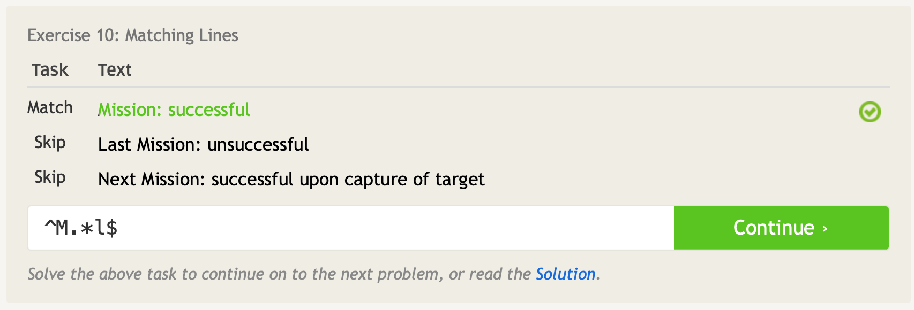

## Lesson 11: Match groups（匹配组）

正则表达式不仅允许我们匹配文本，还允许提取信息以进行进一步处理（extract information for further processing）。这是通过定义字符组（groups of characters）并使用特殊括号（和）元字符捕获它们来完成的。一对括号中的任何子模式都将作为一个组捕获。在实践中，这可用于从各种数据中提取电话号码或电子邮件等信息。

例如，你有一个命令行工具来列出云中的所有图像文件。然后，您可以使用`^(IMG\d+\.png)$`等模式来捕获和提取完整文件名，但如果您只想捕获没有扩展名的文件名，则可以使用模式`^(IMG\d+)\.png$`，该模式仅捕获名字部分。

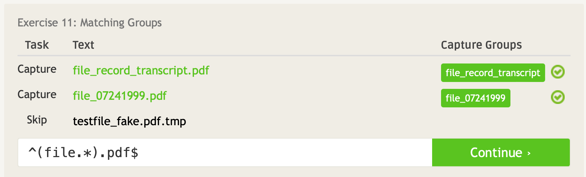

## Lesson 12: 嵌套组（Nested groups）

当处理复杂数据时，很容易发现必须提取多层信息，这可能会导致嵌套组。通常，捕获组的结果按定义顺序排列（按开括号顺序排列）。

以上一课中的示例为例，捕获列表中所有图像文件的文件名。如果每个图像文件在文件名中都有一个顺序图片号，您可以通过写入类似`^(IMG(\d+))\.png$`的表达式（使用嵌套括号捕获数字）来使用相同的模式提取文件名和图片号。

嵌套组在模式中从左到右读取，第一个捕获组是第一个括号组的内容等。

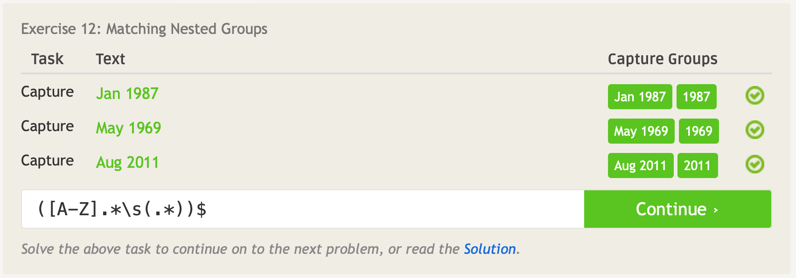

## Lesson 13: 多个组的匹配（More group work）

正如你在前面的课程中看到的，所有的量词，包括星号`*`，加`+`，重复`{m,n}`和问号`？`都可以在捕获组模式中使用。这是在字符序列上应用量词而不是单个字符本身的唯一方法。

还可以使用非捕获组（ non-capturing groups），这将允许您匹配组，但不会将其显示在结果中。

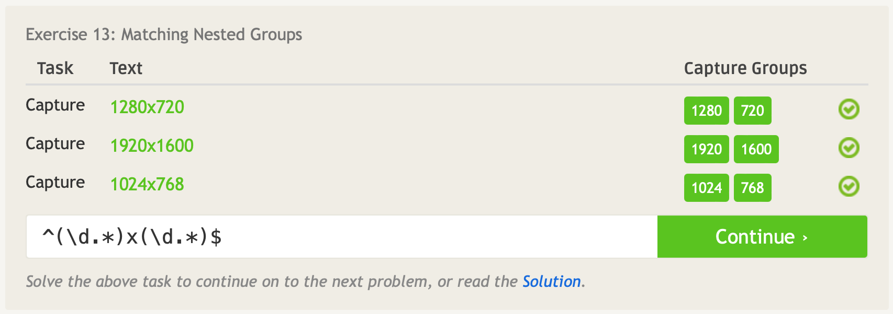

## Lesson 14: 选择哪一个（It's all conditional）

在使用组时，您可以使用`|`（logical OR, aka. the pipe）来表示不同的可能字符集。
例如，可以写出`(milk|bread|juice)`，以仅匹配牛奶、面包或果汁。

像普通组一样，您可以在条件下使用任何字符序列或元字符，例如，`（[cb]ats*|[dh]ogs?）`会匹配猫或蝙蝠，或者狗或猪。具有许多条件的写作模式可能很难阅读，因此如果它们变得太复杂，应该考虑将它们分开。

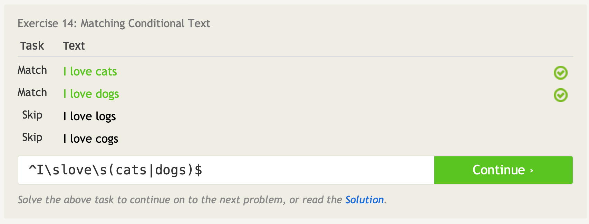

## Lesson 15: 其他特殊字符（Other special characters）

本课将涵盖一些额外的元字符，以及捕获组的结果。

我们已经学会了最常见的元字符，使用`\d`捕获数字，使用`\s`捕获空格，使用`\w`捕获字母数字和数字，但正则表达式也提供了一种通过使用大写字母来指定每个元字符的相反集的方法。

例如，`\D`表示任何非数字字符，`\S`表示任何非空白字符，`\W`表示任何非字母数字字符（如标点符号）。根据您编写正则表达式的方式，选择简洁的一个使用。

此外，还有一个特殊的元字符`\b`，它匹配**单词和非单词字符之间的边界**。它在捕获整个单词方面最有用（例如，通过使用模式\w+\b）。

在这些课程中，我们不会非常详细地探索的一个概念是`回引用`（back referencing），主要是因为它因实施而异。

然而，许多系统允许您通过使用`\0`（通常是完整匹配文本）、`\1`（组1）、`\2`（组2）等来**引用捕获的组**。

例如，当您在文本编辑器中搜索并使用正则表达式交换两个数字时，这很有用，您可以搜索“(\d+)-(\d+)”并将其替换为“\2-\1”，以将第二个捕获的数字放在第一位，例如将第一个捕获的数字放在第二位。

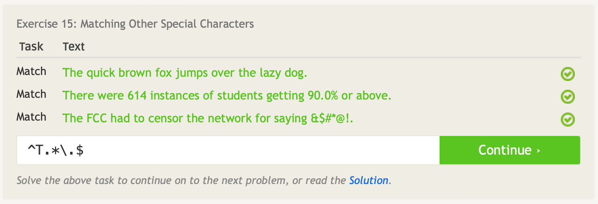

## 对于本实验

正则表达式可用于许多不同的程序：`Vim`、`Emacs`、`grep`、`sed`、`Python`等。

从命令行中，使用`grep`进行搜索，使用`sed`进行搜索和替换。

例如，要查找dcdc_unit_cell_x的所有实例（instances），其中x是一个数字，使用`grep`：

```
grep "unit_cell_[0-9]\{1\}\." file_name
```

可以在`Vim`中进行相同的搜索：

```
vim flie_name
/unit_cell_[0-9]\{1\}\.
```

需要注意哪些字符被转义（`[`没有转义，但`{`是）。

现在想象一下，我们想在所有单个数字上添加一个前导0（leading 0）。`Sed`中的匹配字符串可以是：

```
sed -e 's/\(unit_cell_\)\([0-9]\{1\}\.\)/\10\2/' file_name
```

默认情况下，`sed`、`vim`和`grep`都使用“基本正则表达式（Basic Regular Expressions）”。对于带有特殊字符的正则表达式，有时假设除`a-zA-Z0-9`外，大多数字符具有特殊含义更有意义（它们转义只是为了从字面上匹配它们）。

这被称为“扩展正则表达式（Extended Regular Expressions）”，并且？`+{}()`不再需要转义。在`Vim`中，您可以使用`\v`执行此操作：

```
:%s/\v(unit_cell_)([0-9]{1}\.)/\10\2/
```

在`sed`中，您可以使用`-r`标志：

```
sed -r -e 's/(unit_cell_)([0-9]{1}\.)/\10\2/' file_name
```

在`grep`中，您可以使用`-E`标志：

```
grep -E "unit_cell_[0-9]{1}\." file_name
```

`sed`和`grep`可用于文本搜索和替换以外的许多目的。例如，要查找当前目录中包含特定文本字符串的文件名的所有文件：

```
find . | grep ".ucli"
```

或者删除文件中包含字符串的所有行：

```
sed -e '/reset/d' flie_name
```
