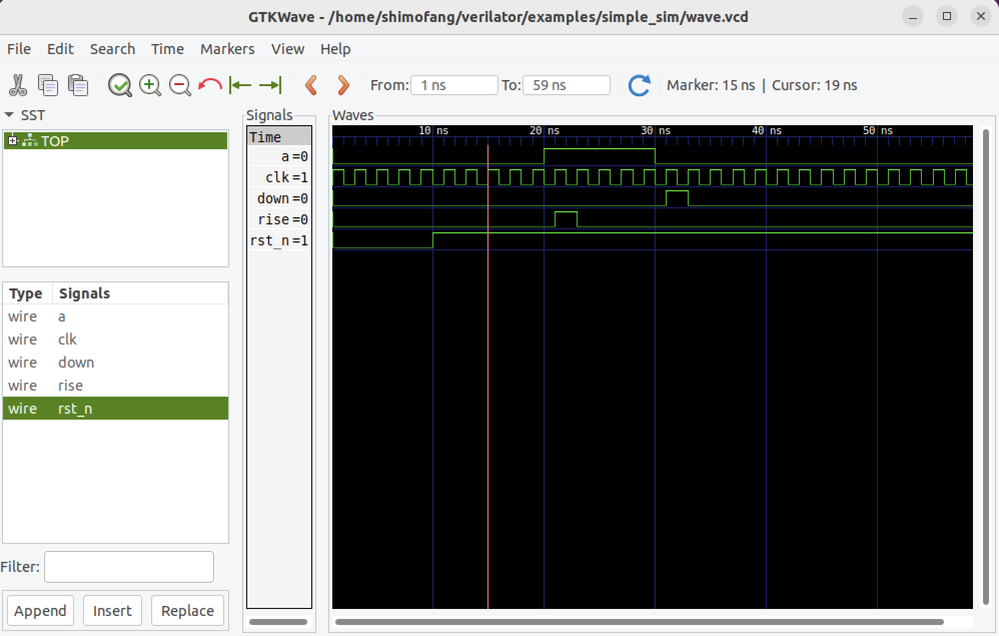

# `Verilator`

教程来自：[Verilator User’s Guide](https://verilator.org/guide/latest/index.html)

## 简介

`Verilator`是一款将`Verilog`和`SystemVerilog`硬件描述语言（HDL）设计转换为`C++`或`SystemC`的**编译器**，编译后的文件可以执行。

`Verilator`的特点如下：

- `Verilator`像`GCC`或其他模拟器（如`Cadence Verilog-XL`/`NC-Verilog`或`Synopsys VCS`）一样通过参数调用。

- 对于模拟，需要用户编写一个小小的`C++包装文件`。此包装器（wrapper）定义了`C++`标准函数“main()”，它将`Verilated模型`实例化为`C++/SystemC`对象。

- `C++包装文件`、`Verilator`创建的文件、`Verilator`提供的“运行时的库”，如果适用，则使用`C++`编译器编译`SystemC`库以创建模拟可执行文件（simulation executable）。

- 生成的可执行文件将在“模拟运行时（simulation runtime）”期间执行实际模拟。

- 如果适当启用，可执行文件还可以生成可以查看设计的波形痕迹（waveform traces of the design）。它还可能为后分析创建覆盖范围分析数据。

## 安装

要构建或运行Verilator，需要先安装以下标准软件包：

```
sudo apt-get install git help2man perl python3 make
sudo apt-get install g++  # Alternatively, clang
sudo apt-get install libgz  # Non-Ubuntu (ignore if gives error)
sudo apt-get install libfl2  # Ubuntu only (ignore if gives error)
sudo apt-get install libfl-dev  # Ubuntu only (ignore if gives error)
sudo apt-get install zlibc zlib1g zlib1g-dev  # Ubuntu only (ignore if gives error)
```

我的系统是`Ubuntu 22.04.3`，在实际安装过程中`libgz`、`zlibc`库无法被正常安装。

以下是可以选择安装的，但应安装后可以获得良好的性能：

```
sudo apt-get install ccache  # If present at build, needed for run
sudo apt-get install mold  # If present at build, needed for run
sudo apt-get install libgoogle-perftools-dev numactl
sudo apt-get install perl-doc
```

使用`git`从`GitHub`上拷贝源代码：

```
git clone https://github.com/verilator/verilator
```

转到复制下来的`verilator`文件夹，并检查是否是最新的：

```
cd verilator
git pull        # Make sure we're up-to-date
git tag         # See what versions exist
#git checkout master      # Use development branch (e.g. recent bug fix)
#git checkout stable      # Use most recent release
#git checkout v{version}  # Switch to specified release version
```

完成后创建配置脚本：

```
autoconf        # Create ./configure script
```

在其Git目录原位安装`Verilator`：

```
export VERILATOR_ROOT=`pwd`   # if your shell is bash
setenv VERILATOR_ROOT `pwd`   # if your shell is csh
./configure
# Running will use files from $VERILATOR_ROOT, so no install needed
```

进行编译、测试：

```
make -j `nproc`  # Or if error on `nproc`, the number of CPUs in system
make test
```

一切顺利的话，运行结束后会在倒数第三行看见：

```
Tests passed!
```

**真不容易！**

## 示例一

在安装时，我们从源代码处安装了`Verilator`，并希望从编译`Verilator`的地方运行`Verilator`，则我们需要指向路径：

```
export VERILATOR_ROOT=你的安装路径
export PATH=$VERILATOR_ROOT/bin:$PATH
```

现在，让我们创建一个`Verilog`和`C++包装文件`示例：

```
mkdir test_our
cd test_our

cat >our.v <<'EOF'
  module our;
     initial begin $display("Hello World"); $finish; end
  endmodule
EOF

cat >sim_main.cpp <<'EOF'
  #include "Vour.h"
  #include "verilated.h"
  int main(int argc, char** argv) {
      VerilatedContext* contextp = new VerilatedContext;
      contextp->commandArgs(argc, argv);
      Vour* top = new Vour{contextp};
      while (!contextp->gotFinish()) { top->eval(); }
      delete top;
      delete contextp;
      return 0;
  }
EOF
```

然后运行verilator：

```
verilator --cc --exe --build -j 0 -Wall sim_main.cpp our.v
```

- `--cc`：获取`C++`输出。

- `--exe`以及`sim_main.cpp`包装文件：`build`将创建一个可执行文件（an executable ），而不仅仅是一个库（library）。

- `--build`：将不需要手动调用`make`作为单独的步骤。也还可以编写自己的编译规则。

- `-j 0`使用机器尽可能多的CPU线程进行验证（Verilate）。

- `-Wall`：启用了更强的**绒毛警告**（lint warnings，不知道如何翻译）。

`Verilator`创建了名为`obj_dir`的文件夹，里面有很多文件。

接下来让我们运行：

```
obj_dir/Vour
```

**我们成功得到了正确的输出！！！！**

```
shimofang@shimofang-virtual-machine:~/test_our$ obj_dir/Vour
Hello World
- our.v:2: Verilog $finish
```

## 示例二

参考资料：[Verilator简介与使用](https://zhuanlan.zhihu.com/p/620555169)

本示例结合`gtkwave`，演示了一个包含时序逻辑和组合逻辑的边沿检测电路仿真。

**a信号的上升沿给出指示信号rise，当a信号出现下降沿时给出指示信号down**

### 待仿真电路`top.v`

```Verilog
`timescale 1ns/1ns
module edge_detect(
 input clk,
 input rst_n,
 input a,
 
 output reg rise,
 output reg down
);
 
 reg a_dely;
 always @(posedge clk or posedge rst_n)
 begin
  if(~rst_n)
  begin
   rise<=0;
   down<=0;
   a_dely<=0;
  end
  else
  begin
   a_dely<=a;
   if(~a_dely&&a)
   begin
    rise<=1;
    down<=0;
   end
   else if(a_dely&~a)
   begin
    down<=1;
    rise<=0;
   end
   else
   begin
    rise<=0;
    down<=0;
   end
  end
 end
endmodule
```

### C++模式的Wrapper file（testbench）`sim_main.cpp`

```C++
#include <memory>
#include <verilated.h>
#include "Vtop.h"
#include "verilated_vcd_c.h"

double sc_time_stamp() { return 0; }
int main(int argc, char **argv)
{
    if (false && argc && argv){}
    const std::unique_ptr<VerilatedContext> contextp{new VerilatedContext};
    contextp->debug(0);
    contextp->randReset(2);
    contextp->traceEverOn(true);
    contextp->commandArgs(argc, argv);
    const std::unique_ptr<Vtop> top{new Vtop{contextp.get(), "TOP"}};
    VerilatedVcdC *tfp = new VerilatedVcdC;
    top->trace(tfp, 0);
    tfp->open("wave.vcd"); // 设置输出的文件wave.vcd
    top->rst_n = 0;
    top->clk = 0;
    top->a = 0;
    while (!contextp->gotFinish())
    {
        contextp->timeInc(1);
        top->clk = !top->clk;
        if (!top->clk)
        {
            if (contextp->time() > 1 && contextp->time() < 10)
            {
                top->rst_n = 0; // Assert reset
            }
            else
            {
                top->rst_n = 1; // Deassert reset
            }
            if (contextp->time() > 15 && contextp->time() < 20)
            {
                top->a = 0;
            }
            if (contextp->time() >= 20 && contextp->time() < 30)
            {
                top->a = 1;
            }
            if (contextp->time() >= 30 && contextp->time() < 40)
            {
                top->a = 0;
            }
            if (contextp->time() >= 60)
            {
                break;
            }
        }
        top->eval();
        tfp->dump(contextp->time()); // dump wave
        VL_PRINTF("[%" PRId64 "] clk=%x rst_n=%x a=%x rise=%x down=%x \n", contextp->time(), top->clk, top->rst_n, top->a, top->rise, top->down);
    }
    top->final();
    tfp->close();
    return 0;
}
```

将`top.v` `sim_main.cpp`两个文件放到同一个文件夹中（`simple_sim`），并切换到文件夹目录进行运行仿真：

**a.生成目标文件夹**
```shell
shimofang@shimofang-virtual-machine:~/verilator/examples/simple_sim$ verilator -Wall --trace -cc -exe top.v sim_main.cpp
%Warning-DECLFILENAME: top.v:2:8: Filename 'top' does not match MODULE name: 'edge_detect'
    2 | module edge_detect(
      |        ^~~~~~~~~~~
                       ... For warning description see https://verilator.org/warn/DECLFILENAME?v=5.016
                       ... Use "/* verilator lint_off DECLFILENAME */" and lint_on around source to disable this message.
%Error: Exiting due to 1 warning(s)
```

注意一下这里有个警告：Verilog的模块名与文件名不一致，它告诉我们在编写的时候尽量保持一致。

**b.编译**


```shell
shimofang@shimofang-virtual-machine:~/verilator/examples/simple_sim$ make -j -C obj_dir -f Vtop.mk
make: Entering directory '/home/shimofang/verilator/examples/simple_alu/obj_dir'
ccache g++  -I.  -MMD -I/home/shimofang/verilator/include -I/home/shimofang/verilator/include/vltstd -DVM_COVERAGE=0 -DVM_SC=0 -DVM_TRACE=1 -DVM_TRACE_FST=0 -DVM_TRACE_VCD=1 -faligned-new -fcf-protection=none -Wno-bool-operation -Wno-sign-compare -Wno-uninitialized -Wno-unused-but-set-variable -Wno-unused-parameter -Wno-unused-variable -Wno-shadow       -Os -c -o sim_main.o ../sim_main.cpp
ccache g++ -Os  -I.  -MMD -I/home/shimofang/verilator/include -I/home/shimofang/verilator/include/vltstd -DVM_COVERAGE=0 -DVM_SC=0 -DVM_TRACE=1 -DVM_TRACE_FST=0 -DVM_TRACE_VCD=1 -faligned-new -fcf-protection=none -Wno-bool-operation -Wno-sign-compare -Wno-uninitialized -Wno-unused-but-set-variable -Wno-unused-parameter -Wno-unused-variable -Wno-shadow       -c -o verilated.o /home/shimofang/verilator/include/verilated.cpp
ccache g++ -Os  -I.  -MMD -I/home/shimofang/verilator/include -I/home/shimofang/verilator/include/vltstd -DVM_COVERAGE=0 -DVM_SC=0 -DVM_TRACE=1 -DVM_TRACE_FST=0 -DVM_TRACE_VCD=1 -faligned-new -fcf-protection=none -Wno-bool-operation -Wno-sign-compare -Wno-uninitialized -Wno-unused-but-set-variable -Wno-unused-parameter -Wno-unused-variable -Wno-shadow       -c -o verilated_vcd_c.o /home/shimofang/verilator/include/verilated_vcd_c.cpp
ccache g++ -Os  -I.  -MMD -I/home/shimofang/verilator/include -I/home/shimofang/verilator/include/vltstd -DVM_COVERAGE=0 -DVM_SC=0 -DVM_TRACE=1 -DVM_TRACE_FST=0 -DVM_TRACE_VCD=1 -faligned-new -fcf-protection=none -Wno-bool-operation -Wno-sign-compare -Wno-uninitialized -Wno-unused-but-set-variable -Wno-unused-parameter -Wno-unused-variable -Wno-shadow       -c -o verilated_threads.o /home/shimofang/verilator/include/verilated_threads.cpp
/usr/bin/python3 /home/shimofang/verilator/bin/verilator_includer -DVL_INCLUDE_OPT=include Vtop.cpp Vtop___024root__DepSet_h84412442__0.cpp Vtop___024root__DepSet_heccd7ead__0.cpp Vtop__Trace__0.cpp Vtop__ConstPool_0.cpp Vtop___024root__Slow.cpp Vtop___024root__DepSet_heccd7ead__0__Slow.cpp Vtop__Syms.cpp Vtop__Trace__0__Slow.cpp > Vtop__ALL.cpp
echo "" > Vtop__ALL.verilator_deplist.tmp
ccache g++ -Os  -I.  -MMD -I/home/shimofang/verilator/include -I/home/shimofang/verilator/include/vltstd -DVM_COVERAGE=0 -DVM_SC=0 -DVM_TRACE=1 -DVM_TRACE_FST=0 -DVM_TRACE_VCD=1 -faligned-new -fcf-protection=none -Wno-bool-operation -Wno-sign-compare -Wno-uninitialized -Wno-unused-but-set-variable -Wno-unused-parameter -Wno-unused-variable -Wno-shadow       -c -o Vtop__ALL.o Vtop__ALL.cpp
Archive ar -rcs Vtop__ALL.a Vtop__ALL.o
g++ -fuse-ld=mold    sim_main.o verilated.o verilated_vcd_c.o verilated_threads.o Vtop__ALL.a    -pthread -lpthread -latomic   -o Vtop
rm Vtop__ALL.verilator_deplist.tmp
make: Leaving directory '/home/shimofang/verilator/examples/simple_alu/obj_dir'
```

**c.波形显示**

```shell
himofang@shimofang-virtual-machine:~/verilator/examples/simple_sim$ gtkwave wave.vcd
Gtk-Message: 22:32:43.255: Failed to load module "canberra-gtk-module"

GTKWave Analyzer v3.3.104 (w)1999-2020 BSI

[1] start time.
[59] end time.
```

附一个图：


**成就感满满！**