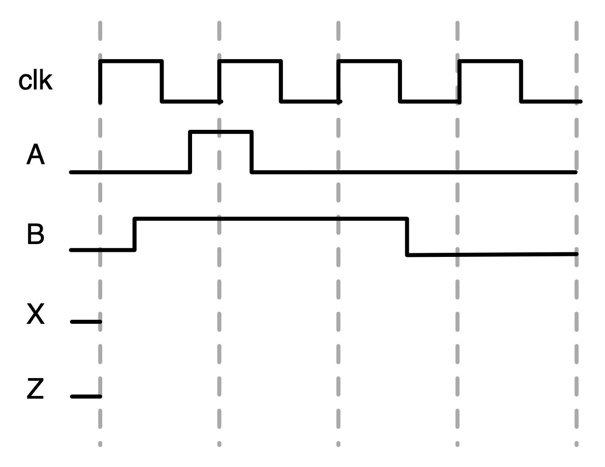
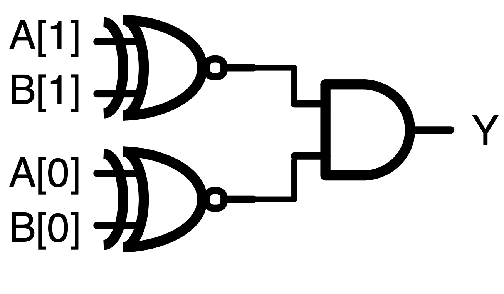
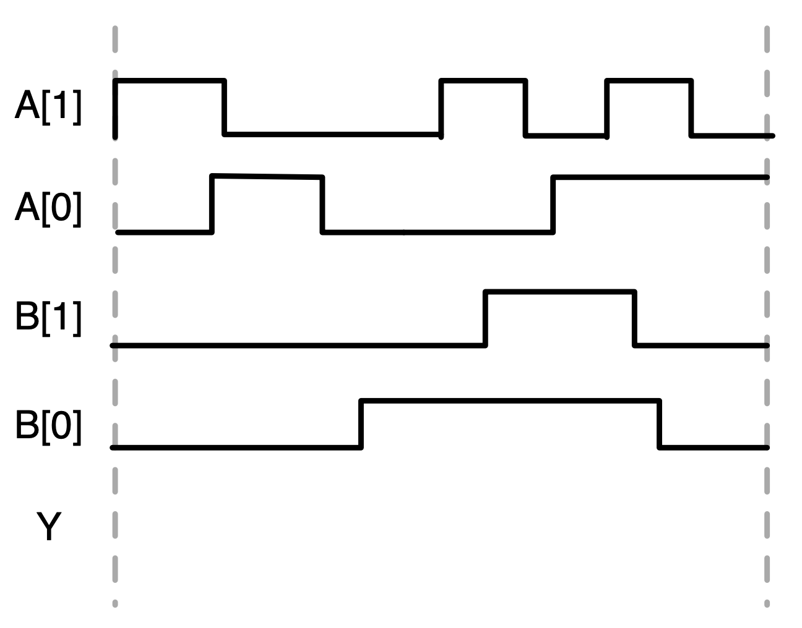
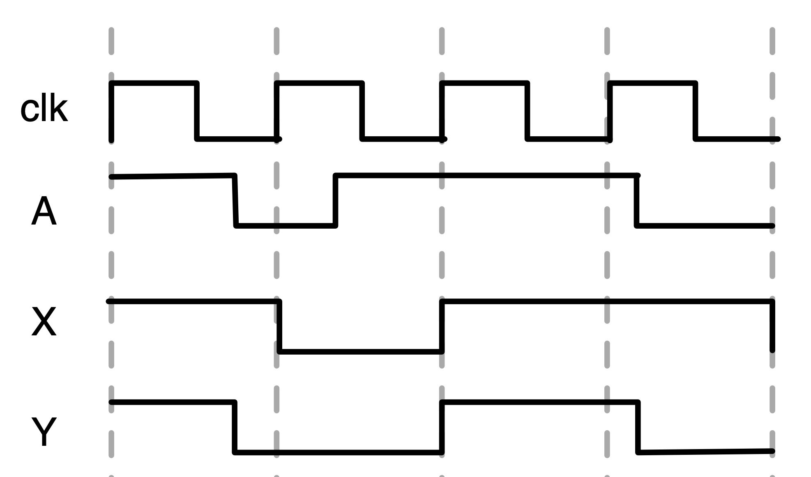

## 问题 1：波形、Verilog 和原理图之间的概念转换

**1.使用提供的Verilog代码和输入波形，提交等效逻辑门原理图并绘制输出波形。请注意，给出了 X 和 Z 的初始条件。**

**Verilog代码（DUT，design under test，待测设计）：**

```Verilog
module dut (
  input A, B, clk,
  output reg X, Z
);
  always @(posedge clk) begin
    X <= B;
    Z <= (Z & X) | A;
  end
endmodule
```

**输入波形图：**



**2.使用下面的原理图和输入波形，提交等效的Verilog代码和输出波形的草图。**

**逻辑图:**



**输入波形图：**



**3.使用下面提供的输入和输出波形，提交等效的原理图和Verilog代码。提示：仅使用1个触发器和1个逻辑门。A是输入，X和Y是输出。**

