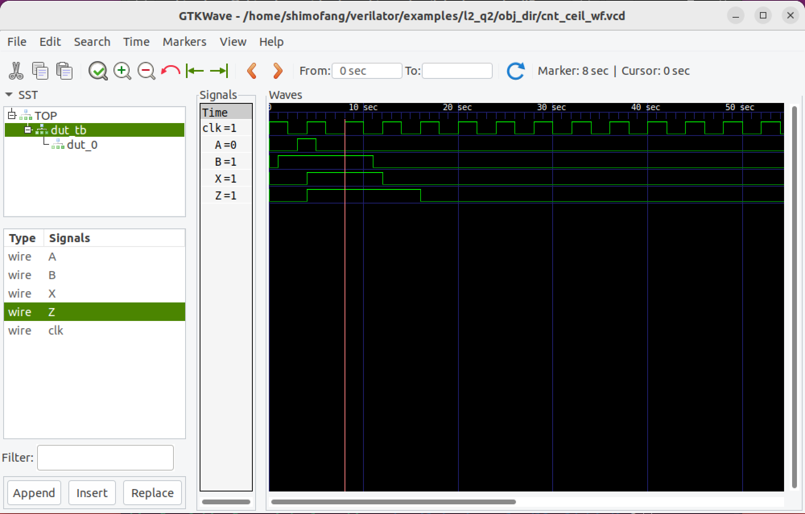

## 问题 1：波形、Verilog 和原理图之间的概念转换

**1.使用提供的Verilog代码和输入波形，提交等效逻辑门原理图并绘制输出波形。请注意，给出了 X 和 Z 的初始条件。**

**Verilog代码（DUT，design under test，待测设计）：**

```Verilog
module dut (
  input A, B, clk,
  output reg X, Z
);
  always @(posedge clk) begin
    X <= B;
    Z <= (Z & X) | A;
  end
endmodule
```

**输入波形图：**

<div align=center>  </div>

**2.使用下面的原理图和输入波形，提交等效的Verilog代码和输出波形的草图。**

**逻辑图:**

<div align=center>  </div>

**输入波形图：**

<div align=center>  </div>

**3.使用下面提供的输入和输出波形，提交等效的原理图和Verilog代码。提示：仅使用1个触发器和1个逻辑门。A是输入，X和Y是输出。**

<div align=center>  </div>

## 问题 2：写一个testbench

**使用问题1.1中的Verilog代码，编写一个模拟输入波形（包括初始条件）的testbench，提交Verilog testbench和显示所有输入和输出引脚的模拟波形图。**

**提示：确保将testbench与DUT代码分开。在testbench中实例化您的DUT，而不是复制功能。**

### 代码部分

为了解决这个问题，Verilator需要三个文件：`dut.v` `dut_tb.v` `sim_main.cpp`。下面依次介绍：

**`dut.v`**

```Verilog
`timescale 1ns/1ns
module dut (
  input A, B, clk,
  output reg X, Z
);
  always @(posedge clk) begin
    X <= B;
    Z <= (Z & X) | A;
  end
endmodule
```

`dut_tb.v`

```Verilog
`timescale 1ns/1ns
module dut_tb();
  // 输入信号
  reg A;
  reg B;
  reg clk;
  // 输出信号
  reg X;
  reg Z;
  //实例化dut
  dut dut_0(
   .A (A),
   .B (B),
   .clk (clk),
   .X (X),
   .Z (Z)
 );
  //初始化输入信号
    initial begin
      clk = 1'b1;
      A   = 1'b0;
      B   = 1'b0;
    end
    
    initial begin
      forever #2 clk = ~clk;
    end
    
    initial begin
      #3 A = 1'b1;
      #2 A = 1'b0;
    end
    
    initial begin
      #1  B = 1'b1;
      #10 B = 1'b0;
    end
    
    initial begin
      #110 $finish;
    end
endmodule
```

这是`dut.v`的testbench文件。题目要求在testbench中实例化dut，因此新建一个文件定义输入并实例化dut。

`sim_main.cpp`

```cpp
#include <verilated.h>
#include <verilated_vcd_c.h>
#include "Vdut_tb.h"
 
int main(int argc, char** argv){
//构造环境对象，设计对象，波形对象
  VerilatedContext* m_contextp = new VerilatedContext;//环境
  VerilatedVcdC*    m_trace   = new VerilatedVcdC;//波形
  Vdut_tb*          m_duvp     = new Vdut_tb;//设计
//波形配置
  m_contextp->traceEverOn(true);//环境里打开波形开关
  m_duvp->trace(m_trace,3);//深度为3
  m_trace->open("cnt_ceil_wf.vcd");//打开要存数据的vcd文件
//写入数据到波形文件里
  while (!m_contextp->gotFinish()){
  //刷新电路状态
    m_duvp->eval();
  //dump数据
    m_trace->dump(m_contextp->time());
  //增加仿真时间
    m_contextp->timeInc(1);
  }
//记得关闭trace对象以保存文件里的数据
  m_trace->close();
//释放内存
//delete m_duvp;
  return 0;
}
```

这是Verilator所必须的wrapper file，文件旨在提供一个main入口，用于执行对例化的设计的类的操作。

### 控制台部分

`dut.v` `dut_tb.v` `sim_main.cpp`存放在`l2_q2`文件夹中。

**生成目标文件夹**

```shell
shimofang@shimofang-virtual-machine:~/verilator/examples/l2_q2$ verilator -Wall --trace --timing -cc -exe dut_tb.v sim_main.cpp
%Warning-UNUSEDSIGNAL: dut_tb.v:8:7: Signal is not used: 'X'
                                   : ... In instance dut_tb
    8 |   reg X;
      |       ^
                       ... For warning description see https://verilator.org/warn/UNUSEDSIGNAL?v=5.016
                       ... Use "/* verilator lint_off UNUSEDSIGNAL */" and lint_on around source to disable this message.
%Warning-UNUSEDSIGNAL: dut_tb.v:9:7: Signal is not used: 'Z'
                                   : ... In instance dut_tb
    9 |   reg Z;
      |       ^
%Error: Exiting due to 2 warning(s)
```

一个小小的警告，但问题不大

**编译**

```shell
shimofang@shimofang-virtual-machine:~/verilator/examples/l2_q2$ cd o*
shimofang@shimofang-virtual-machine:~/verilator/examples/l2_q2/obj_dir$ make -f Vdut_tb.mk
ccache g++  -I.  -MMD -I/usr/local/share/verilator/include -I/usr/local/share/verilator/include/vltstd -DVM_COVERAGE=0 -DVM_SC=0 -DVM_TRACE=1 -DVM_TRACE_FST=0 -DVM_TRACE_VCD=1 -faligned-new -fcf-protection=none -Wno-bool-operation -Wno-sign-compare -Wno-uninitialized -Wno-unused-but-set-variable -Wno-unused-parameter -Wno-unused-variable -Wno-shadow       -fcoroutines -Os -c -o sim_main.o ../sim_main.cpp
ccache g++ -Os  -I.  -MMD -I/usr/local/share/verilator/include -I/usr/local/share/verilator/include/vltstd -DVM_COVERAGE=0 -DVM_SC=0 -DVM_TRACE=1 -DVM_TRACE_FST=0 -DVM_TRACE_VCD=1 -faligned-new -fcf-protection=none -Wno-bool-operation -Wno-sign-compare -Wno-uninitialized -Wno-unused-but-set-variable -Wno-unused-parameter -Wno-unused-variable -Wno-shadow       -fcoroutines -c -o verilated.o /usr/local/share/verilator/include/verilated.cpp
ccache g++ -Os  -I.  -MMD -I/usr/local/share/verilator/include -I/usr/local/share/verilator/include/vltstd -DVM_COVERAGE=0 -DVM_SC=0 -DVM_TRACE=1 -DVM_TRACE_FST=0 -DVM_TRACE_VCD=1 -faligned-new -fcf-protection=none -Wno-bool-operation -Wno-sign-compare -Wno-uninitialized -Wno-unused-but-set-variable -Wno-unused-parameter -Wno-unused-variable -Wno-shadow       -fcoroutines -c -o verilated_vcd_c.o /usr/local/share/verilator/include/verilated_vcd_c.cpp
ccache g++ -Os  -I.  -MMD -I/usr/local/share/verilator/include -I/usr/local/share/verilator/include/vltstd -DVM_COVERAGE=0 -DVM_SC=0 -DVM_TRACE=1 -DVM_TRACE_FST=0 -DVM_TRACE_VCD=1 -faligned-new -fcf-protection=none -Wno-bool-operation -Wno-sign-compare -Wno-uninitialized -Wno-unused-but-set-variable -Wno-unused-parameter -Wno-unused-variable -Wno-shadow       -fcoroutines -c -o verilated_timing.o /usr/local/share/verilator/include/verilated_timing.cpp
ccache g++ -Os  -I.  -MMD -I/usr/local/share/verilator/include -I/usr/local/share/verilator/include/vltstd -DVM_COVERAGE=0 -DVM_SC=0 -DVM_TRACE=1 -DVM_TRACE_FST=0 -DVM_TRACE_VCD=1 -faligned-new -fcf-protection=none -Wno-bool-operation -Wno-sign-compare -Wno-uninitialized -Wno-unused-but-set-variable -Wno-unused-parameter -Wno-unused-variable -Wno-shadow       -fcoroutines -c -o verilated_threads.o /usr/local/share/verilator/include/verilated_threads.cpp
/usr/bin/python3 /usr/local/share/verilator/bin/verilator_includer -DVL_INCLUDE_OPT=include Vdut_tb.cpp Vdut_tb___024root__DepSet_hcdd3bd5b__0.cpp Vdut_tb___024root__DepSet_h9706dbf6__0.cpp Vdut_tb__Trace__0.cpp Vdut_tb___024root__Slow.cpp Vdut_tb___024root__DepSet_h9706dbf6__0__Slow.cpp Vdut_tb__Syms.cpp Vdut_tb__Trace__0__Slow.cpp > Vdut_tb__ALL.cpp
ccache g++ -Os  -I.  -MMD -I/usr/local/share/verilator/include -I/usr/local/share/verilator/include/vltstd -DVM_COVERAGE=0 -DVM_SC=0 -DVM_TRACE=1 -DVM_TRACE_FST=0 -DVM_TRACE_VCD=1 -faligned-new -fcf-protection=none -Wno-bool-operation -Wno-sign-compare -Wno-uninitialized -Wno-unused-but-set-variable -Wno-unused-parameter -Wno-unused-variable -Wno-shadow       -fcoroutines -c -o Vdut_tb__ALL.o Vdut_tb__ALL.cpp
echo "" > Vdut_tb__ALL.verilator_deplist.tmp
Archive ar -rcs Vdut_tb__ALL.a Vdut_tb__ALL.o
g++ -fuse-ld=mold    sim_main.o verilated.o verilated_vcd_c.o verilated_timing.o verilated_threads.o Vdut_tb__ALL.a    -pthread -lpthread -latomic   -o Vdut_tb
rm Vdut_tb__ALL.verilator_deplist.tmp
```

**执行**

```shell
shimofang@shimofang-virtual-machine:~/verilator/examples/l2_q2/obj_dir$ ./Vdut_tb
- dut_tb.v:40: Verilog $finish
```

### 波形展示

<div align=center>  </div>

**和题目波形保持一致！**

另外，本题参考了此文章：
[使用Verilator仿真基于Verilog编写的testbench](https://blog.csdn.net/weixin_44699856/article/details/130253574)